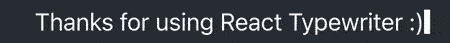

<h1 align="center"> 〰 ⌨️ 〰 React Typewriter 〰 ⌨️ 〰</h1>
<p align="center">
 

<a href="https://github.com/gerardmarquinarubio/ReactTypewriter/releases" target="_blank">

</a>
<a href="https://www.npmjs.com/package/react-ts-typewriter" target="_blank">

</a>
<a href="https://github.com/brillout/awesome-react-components#ui-animation" target="_blank">

</a>

</p>
React Typewriter is a simple component that allows you to create a nice "typewriter" effect to any text by simply invoking the component. <a href="https://codesandbox.io/s/react-typewriter-example-mgyclf" target="_blank">Try on codesandbox.io</a>.

## Installation

```sh
npm i react-ts-typewriter
```

## Example usage

```tsx
import Typewriter from 'react-ts-typewriter';

export default function myComponent() {
    return (
        <h1>
            <Typewriter text='Hello' />
        </h1>
    )
}
```

## Props
> text : string | string[]

Text to display as string or an array of strings. **Required** 

> speed?: number = 30

How long (in ms) does the the typewriter wait after typing one character. *Defaults to 30ms*.

> loop?: boolean = false

Set to true if the typewriter should loop after finishing typing the string(s). *Defaults to false*.

> random?: number = 30

Ms of randomness that should be added after each keystroke. If set to zero then each stroke will strictly take <code>speed</code>ms to complete. *Defaults to 30ms*.

> delay?: number = 30

Ms to wait after compleating the word. Useless if loop is set to false or text is not an array. *Defaults to 30ms*.

> cursor?: boolean = true

Set to false if the typewriter should not render a blinking cursor character at the end of the string. *Defaults to true*

> onFinished?: Function = () => void

Callback function after Typewriter animation is complete, never triggers if <code>loop</code> is true. *Defaults to () => void*

> onStart?: Function = () => void

Callback function before Typewriter animation is started on each string. *Defaults to () => void*.